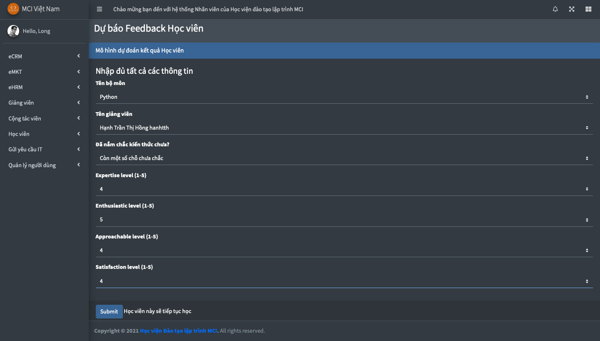

# Applying Machine Learning Model in Business System of MCI Company

## Description

MCI is a data analytics training center. MCI has always been collecting feedbacks from students after they complete courses at their center. These feedbacks help MCI to improve weaknesses and promote strengths in the future as well as adjust teaching methods to be more appealing to students so they can consider to continue study other courses. However, are the current criteria for assessing the student's course student feedback appropriate? Are there any feedback criteria that affect students' choice of continue learning? Therefore, it is crucial to analyze the data to find the necessary factors in students' decision to continue their studies. By building Machine Learning models and putting them into MCI's business system, we can predict whether students will continue to attend other MCI courses and optimize in teaching effectiveness and business efficiency

---

## Implementation

### 1. Requirements

All the necessary library are noted in [requirements.txt](./requirements.txt), please run the following command to install:

```python
pip install -r requirements.txt
```
### 2. Check demo website applied Machine Learning Model

(Make sure that your terminal is on **feedback_prediction** file)

Run the following command to open server:
```python
python /Deploy/server.py
```
A link ```python http://127.0.0.1:5000/``` will be appeared after running the previous command, access that link to run the server.  

---

## Results

### 1. Performance of three algorithms

|Model|Precision|Recall|F1-score|
|-|-|-|-|
|Decision Tree |93.5|93.5|93.5| 
|Random Forest|92|92|92|
|Logistic Regression|89.5|90|90|

### 2. Machine Learning model applied in MCI Business System

<center></center>
